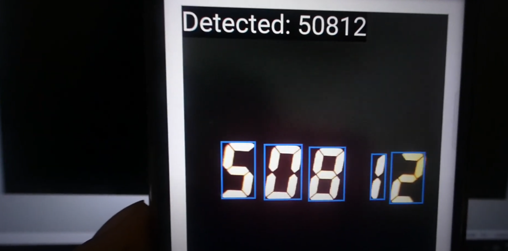

# PyTorch Digit Classifier
This repository contains a PyTorch digit classifier.

The model from this repository is used in Flutter. See the demo here: [YouTube Digit Detection in Flutter](https://youtube.com/playlist?list=PLuVz-FGt23yIQaxZakrhQMe0p5vFv4bGn&feature=shared)

## Screenshot

  

